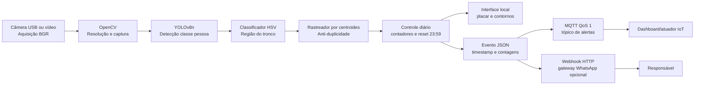

# Documento de Arquitetura IoT e Visão Computacional

## 1. Objetivo e resultado esperado

O sistema identifica pessoas em um corredor, classifica visualmente o uso de uniforme pela cor predominante na região do tronco e exibe, na mesma tela da câmera, um placar com o número de pessoas com e sem uniforme. Cada pessoa é contada uma vez durante o dia. À meia-noite, os contadores são zerados. Pessoas conformes recebem contorno verde e pessoas não conformes recebem contorno vermelho.

O processamento também gera eventos estruturados. Um evento de não conformidade aciona alerta visual local e pode ser publicado via MQTT e enviado a um endpoint HTTP de integração com um gateway de WhatsApp.

## 2. Arquitetura proposta



A câmera é o componente de aquisição. O OpenCV controla o fluxo de frames. O YOLOv8n localiza pessoas. O classificador HSV toma a decisão de conformidade. O rastreador relaciona detecções próximas entre frames para evitar contagens repetidas. O módulo de comunicação publica o evento e registra o resultado no arquivo JSON Lines.

## 3. Requisitos

| Requisito | Componente responsável | Impacto na arquitetura |
|---|---|---|
| Capturar imagens de câmera USB | OpenCV | Requer interface UVC e tratamento de falha de abertura |
| Detectar somente pessoas | YOLOv8n | Usa classe COCO 0 e limiar de confiança configurável |
| Classificar uniforme por cor | Classificador HSV | Exige região de tronco, faixas HSV e limiar de proporção |
| Contar cada pessoa uma vez | Rastreador por centroides | Mantém IDs temporários e distância máxima de associação |
| Mostrar conformes em verde e não conformes em vermelho | Interface OpenCV | Requer desenho de caixas e etiquetas sobre o frame |
| Atualizar contadores em tempo próximo ao real | Laço de processamento | Processa um a cada dois frames e reduz a resolução de inferência |
| Zerar contadores após 23:59 | Controle diário | Compara a data atual e limpa contagens ao mudar o dia |
| Publicar eventos estruturados | Módulo IoT | MQTT com QoS 1 e payload JSON |
| Alertar não conformidade | Módulo de alerta | Publicação MQTT, webhook opcional e registro local |
| Continuar operando sem broker | Módulo IoT | MQTT é opcional; falhas são registradas sem interromper a visão |
| Registrar ações e falhas | Log JSONL | Permite auditoria de contagens, resets e tentativas de envio |

## 4. Protocolos e mensagem

O protocolo principal de publicação é MQTT, adequado para comunicação leve entre dispositivos IoT. O tópico padrão é `senai/corredor/alertas`. A publicação usa QoS 1, que solicita entrega pelo menos uma vez. Consumidores devem aceitar possível duplicidade e usar `timestamp` e `track_id` para deduplicação.

O formato de evento é:

```json
{
  "timestamp": "2026-09-08T14:10:00-03:00",
  "pessoas_com_uniforme": 12,
  "pessoas_sem_uniforme": 2,
  "classificacao": "sem_uniforme",
  "track_id": 8
}
```

A integração HTTP é complementar. O endpoint deve ser fornecido por um gateway autorizado. A mensagem enviada deve ser baseada no evento e não deve conter credenciais no código. Em produção, o endpoint deve exigir HTTPS e autenticação por segredo armazenado em variável de ambiente.

## 5. Parametrização do sensoriamento

| Parâmetro | Valor inicial | Faixa aceitável | Critério de validação |
|---|---:|---:|---|
| Fonte | `0` | índice USB ou caminho de vídeo | Abertura bem-sucedida em `VideoCapture` |
| Resolução de captura | 1280 × 720 | 640 × 480 a 1920 × 1080 | Imagem sem deformação e campo de visão suficiente |
| Resolução de inferência | 640 px de largura | 416 a 960 px | Detecção estável sem latência excessiva |
| Formato | BGR convertido para HSV | BGR/HSV | Conversão OpenCV sem frame vazio |
| Taxa de processamento | 1 a cada 2 frames | 1 a cada 1–4 frames | Latência visual próxima ao tempo real |
| Confiança YOLO | 0,35 | 0,25–0,70 | Reduz falsos positivos sem perder pessoas |
| Região de cor | 28%–75% da altura da caixa | 20%–85% | Recorte cobre o tronco e exclui rosto/fundo |
| Espaço de cor | HSV | H: 0–179, S/V: 0–255 | Faixas ajustadas com amostras do ambiente |
| Proporção mínima uniforme | 0,28 | 0,15–0,60 | Validação com imagens de uniforme e sem uniforme |
| Distância máxima de associação | 110 px | 50–180 px | Não troca IDs em movimento normal |
| Frames ausentes | 12 | 5–30 | Não encerra uma pessoa por oclusão breve |

Para o uniforme verde informado, a faixa inicial é `H 55–95, S 45–255, V 80–255`, correspondente aproximadamente a RGB `(121, 242, 178)` com tolerância para iluminação. A equipe deve coletar amostras com iluminação clara, média e baixa. A faixa deve ser mantida somente quando a máscara cobre o tronco uniformizado e não cobre predominantemente o fundo.

## 6. Regras de controle

Uma nova detecção recebe um ID quando não existe centroides anterior dentro da distância máxima. O contador correspondente é incrementado somente nesse momento. A persistência visual entre frames atualiza o mesmo ID e não incrementa o contador. Quando a data do sistema muda, os IDs e os dois contadores são zerados e um evento `reset_diario` é registrado.

A não conformidade é identificada quando a proporção de pixels dentro das faixas HSV fica abaixo de `min_uniform_ratio`. O contorno vermelho é desenhado e um evento de alerta é emitido. Um intervalo de supressão evita repetição contínua de alertas para a mesma condição.

## 7. Tratamento de falhas

Se a câmera não abrir, o programa encerra com mensagem de erro. Se um vídeo terminar, ele é reiniciado para testes. Falhas no broker MQTT ou no webhook são registradas e não interrompem a exibição local. A reconexão MQTT ocorre na próxima inicialização; para operação contínua, recomenda-se um supervisor de processo que reinicie a aplicação em caso de falha.

## 8. Correspondência com a lista de verificação

| Critério | Evidência no projeto |
|---|---|
| Componentes de aquisição, processamento, IoT e alerta | Diagrama Mermaid e seção de arquitetura |
| Requisito não funcional de desempenho | Processamento a cada dois frames e resolução reduzida |
| Protocolo e papel de publicação | MQTT, tópico, QoS 1 e payload JSON |
| Parâmetros de câmera USB | Tabela de parametrização |
| Espaço de cor e limiares | HSV, faixas H/S/V e proporção mínima |
| Evitar contagens duplicadas | Rastreamento por centroides e IDs temporários |
| Coleta automática de eventos | Publicação após criação de nova trilha |
| Alerta visual/sonoro ou comunicação | Contorno vermelho, MQTT e webhook HTTP |
| Registro estruturado | `eventos.jsonl` com timestamp e resultado do envio |

## Referências

[1]: https://docs.opencv.org/4.x/df/d9d/tutorial_py_colorspaces.html "OpenCV: Changing Colorspaces"

[2]: https://docs.ultralytics.com/modes/predict/ "Ultralytics YOLO Predict Mode"

[3]: https://mqtt.org/mqtt-specification/ "MQTT Specification"
